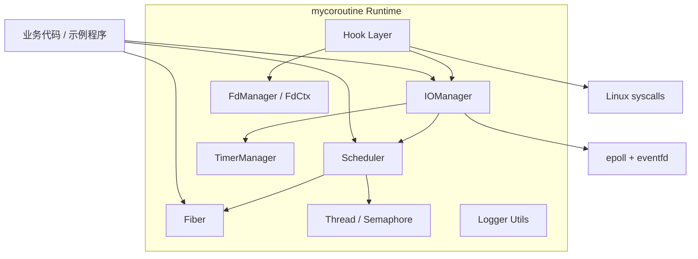
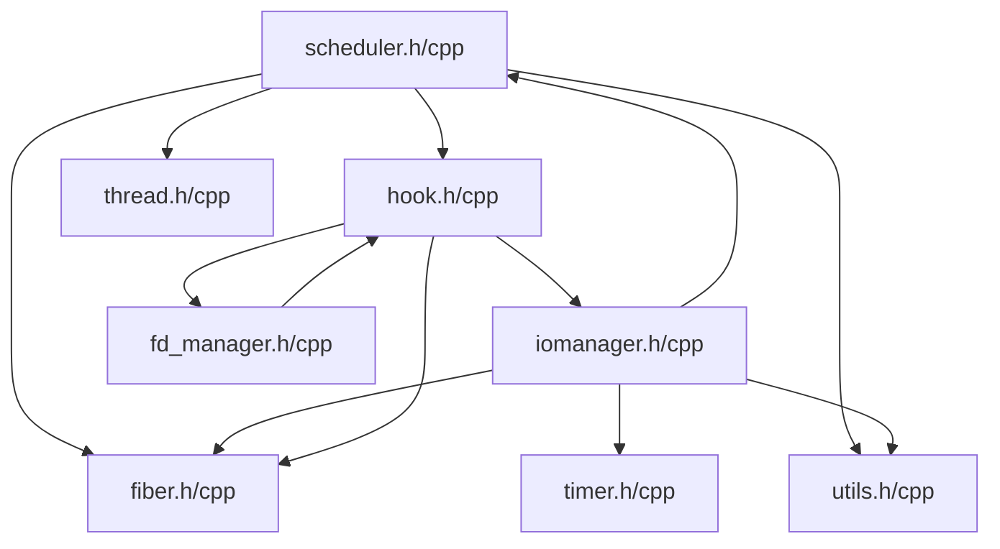
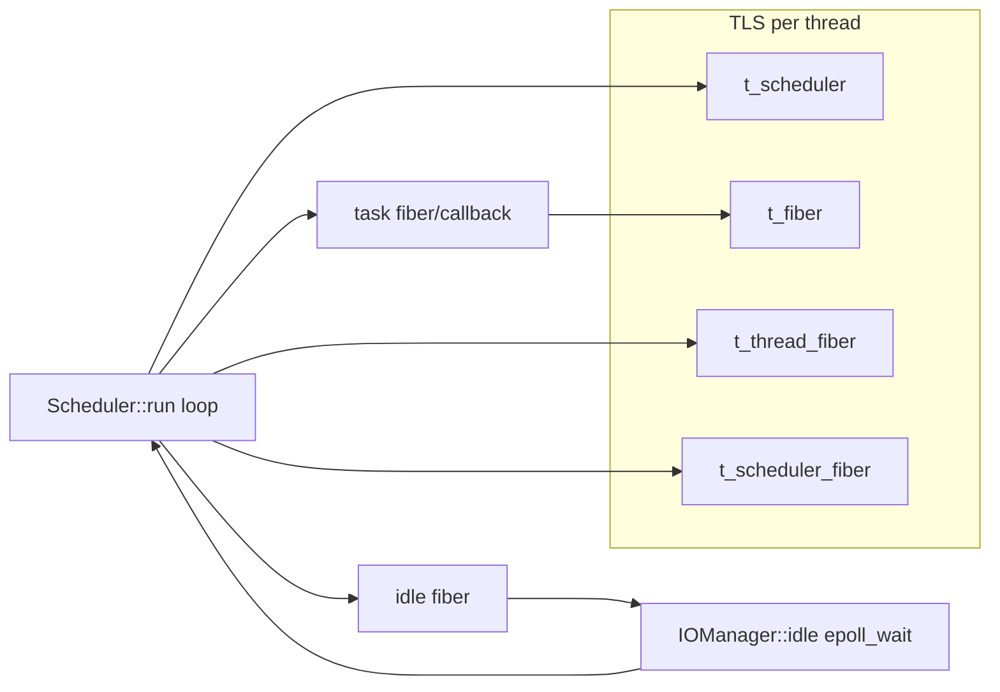

# ARCHITECTURE

## 文档目的

本文档说明 `mycoroutine` 的整体架构、模块依赖与运行时组件关系，帮助读者快速建立“这套协程库由什么组成、如何协作”的全局认知。

---

## 1. 项目总体结构说明

`mycoroutine` 是一个小型协程运行时，整体可拆为四层：

1. 基础设施层：线程封装、日志工具、FD 上下文
2. 协程与调度层：`Fiber`、`Scheduler`
3. 事件与时间层：`IOManager`（`epoll`）、`TimerManager`
4. 系统调用适配层：`hook`（将阻塞调用接入协程调度）

这个分层并不是抽象文档中的“理想分层”，而是当前代码中的实际组织方式。

---

## 2. 主要模块列表与职责概览

- `Fiber`：协程对象与 `ucontext` 上下文切换
- `Scheduler`：任务队列、多线程调度、空闲协程
- `IOManager`：`epoll + eventfd` 事件循环，继承 `Scheduler` 与 `TimerManager`
- `TimerManager`：定时器集合管理与过期回调收集
- `hook`：Hook 阻塞系统调用，转为“注册事件 + yield + 恢复重试”
- `FdManager/FdCtx`：管理 fd 的 socket/nonblock/timeout 状态
- `Thread/Semaphore`：线程包装与启动同步
- `Logger(utils)`：基础日志接口

---

## 3. 项目总体架构图（Mermaid）

图示说明：
- `IOManager` 是调度器扩展，不是独立线程池框架。
- Hook 层并不直接“执行异步 IO”，而是把阻塞调用接入 `IOManager` 的事件等待。

---

## 4. 模块依赖关系图（Mermaid）

依赖说明：
- `hook` 与 `fd_manager` 存在互相引用关系（通过头文件和函数指针协作）。
- `Scheduler` 在 `run()` 中调用 `set_hook_enable(true)`，使 worker 线程默认启用 Hook。

---

## 5. 运行时组件关系图（Mermaid）

运行时说明：
- 每个线程维护独立 TLS 协程上下文指针。
- 普通任务协程与调度协程间通过 `swapcontext` 切换。
- `IOManager::idle()` 在空闲时阻塞于 `epoll_wait`，事件就绪后再把任务重新投递到调度器。

---

## 6. 整体数据流与控制流

## 6.1 控制流（简化）

1. 业务调用 `scheduleLock()` 投递任务
2. `Scheduler::run()` 取任务并执行（协程或回调封装协程）
3. 若任务触发 Hook IO 且返回 `EAGAIN`：
   - 注册 fd 事件到 `IOManager`
   - 当前协程 `yield()`
4. `IOManager::idle()` 收到 `epoll` 事件，触发回调/协程重新入队
5. 协程恢复执行并重试原系统调用

## 6.2 数据流（关键数据结构）

- 调度队列：`Scheduler::m_tasks`（`std::vector<ScheduleTask>`）
- fd 事件上下文：`IOManager::FdContext`（`read/write` 两组 `EventContext`）
- 定时器集合：`TimerManager::m_timers`（`std::set<std::shared_ptr<Timer>>`）
- fd 元信息：`FdManager::m_datas`（`std::vector<std::shared_ptr<FdCtx>>`）

---

## 7. 架构边界与当前约束

- 依赖 Linux 能力：`ucontext`、`epoll`、`eventfd`、`dlsym`。
- 不包含网络协议栈封装（HTTP/TCP 业务逻辑在示例层）。
- 调度策略为单任务队列扫描模型，暂未实现 work-stealing。
- 定时器基于 `system_clock`，受到系统时钟调整影响。

