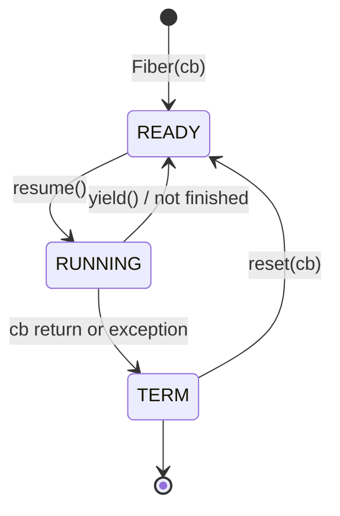

# DESIGN

## 文档目的

本文档聚焦“为什么这样设计”和“当前代码是怎么实现的”，覆盖协程实现方式、调度机制、状态机、切换流程、退出与资源回收。

---

## 1. 设计目标

当前实现的设计目标非常明确：

1. 实现可运行的协程运行时最小闭环
2. 保持系统编程特性（线程、fd、epoll、超时）
3. 代码规模可控，便于理解与调试

因此它优先选择“实现透明、路径完整”，而不是“接口复杂度最低”或“极致性能”。

---

## 2. 协程实现方式

## 2.1 模型选择

- 类型：**有栈协程（stackful coroutine）**
- 上下文机制：`ucontext`（`getcontext/makecontext/swapcontext`）
- 实现位置：`fiber.h` / `fiber.cpp`

## 2.2 为什么采用该方式

- 可直接在任意调用栈深度 `yield`，恢复时继续原栈帧
- 与 `Scheduler`、Hook IO 结合路径清晰
- 学习成本较低，适合教学和小型项目

主要代价：
- 依赖 `ucontext`，可移植性一般
- 每个协程独立栈（默认 128KB）带来内存成本

---

## 3. 调度器设计思想

## 3.1 调度模型

`Scheduler` 维护任务队列 `m_tasks`，任务单元为 `ScheduleTask`：
- `fiber`（协程任务）
- `cb`（回调任务）
- `thread`（线程亲和 id，`-1` 表示任意线程）

worker 线程在 `run()` 循环中：
- 取一个可执行任务
- 执行协程或将回调包装为临时协程执行
- 无任务则运行 `idle_fiber`

## 3.2 `use_caller` 设计

- `use_caller=true`：调用者线程也参与调度
- 构造时创建 `m_schedulerFiber`，由主线程驱动调度循环

该设计减少了“必须额外开线程”的门槛，也能覆盖“主线程参与调度”的常见模式。

---

## 4. 协程生命周期与状态管理

`Fiber::State` 只有三个状态：

- `READY`：就绪，可被调度
- `RUNNING`：执行中
- `TERM`：执行结束

状态迁移规则：
- 新建协程：`READY`
- `resume()`：`READY -> RUNNING`
- `yield()`（未结束）：`RUNNING -> READY`
- `MainFunc` 执行完成：`RUNNING -> TERM`

---

## 5. 协程生命周期图（Mermaid）



说明：
- `reset(cb)` 只能作用于 `TERM` 协程。
- 入口函数 `MainFunc` 内部会捕获异常，保证状态可收敛到 `TERM`。

---

## 6. 协程切换设计

当前线程有三类 TLS 指针：

- `t_thread_fiber`：线程主协程
- `t_scheduler_fiber`：调度协程
- `t_fiber`：当前执行协程

`Fiber::resume()` 和 `yield()` 的切换目标由 `m_runInScheduler` 决定：
- `true`：协程与调度协程互切
- `false`：协程与线程主协程互切

---

## 7. 协程切换流程图（Mermaid）

```mermaid
flowchart TD
    A[Scheduler picks READY fiber] --> B[Fiber::resume]
    B --> C[SetThis(this)]
    C --> D{run_in_scheduler?}
    D -- yes --> E[swapcontext scheduler_ctx -> fiber_ctx]
    D -- no --> F[swapcontext thread_main_ctx -> fiber_ctx]

    E --> G[Fiber executes cb]
    F --> G

    G --> H[Fiber::yield]
    H --> I{state TERM?}
    I -- no --> J[state = READY]
    I -- yes --> K[state = TERM]

    J --> L[swapcontext fiber_ctx -> scheduler/thread_ctx]
    K --> L
```

---

## 8. 调度器工作流程图（Mermaid）

```mermaid
flowchart TD
    START[Scheduler::run] --> HOOK[set_hook_enable(true)]
    HOOK --> LOOP{while true}

    LOOP --> PICK[scan m_tasks]
    PICK --> HAS_TASK{task found?}

    HAS_TASK -- yes --> EXEC{fiber or cb}
    EXEC -- fiber --> R1[fiber->resume]
    EXEC -- cb --> R2[make Fiber(cb) and resume]
    R1 --> LOOP
    R2 --> LOOP

    HAS_TASK -- no --> IDLE[idle_fiber->resume]
    IDLE --> TERMCHK{idle fiber TERM?}
    TERMCHK -- no --> LOOP
    TERMCHK -- yes --> END[exit run]
```

---

## 9. 协程退出与资源回收机制

协程入口 `Fiber::MainFunc()` 执行流程：

1. 获取当前协程智能指针，保证执行期间对象存活
2. 执行 `m_cb`（带异常捕获）
3. 清空 `m_cb`，状态置为 `TERM`
4. 释放当前 `shared_ptr`，保留裸指针
5. 调用 `yield()` 把控制权交回调度侧

资源回收：
- 协程对象析构时释放栈内存 `free(m_stack)`
- 非主协程都持有独立栈

---

## 10. 错误处理与边界处理

当前实现采用“`assert + errno + 错误返回`”混合策略：

- 结构性不变量（状态非法、空指针不应出现）用 `assert`
- 系统调用失败使用返回值/`errno`
- Hook IO 中处理 `EINTR`、`EAGAIN`、超时（`ETIMEDOUT`）

边界行为：
- `do_io` 若不在 `IOManager` 线程中，回退到原始系统调用路径
- `addEvent` 对非法 `fd` 直接失败
- 事件取消接口统一返回 `bool` 语义

