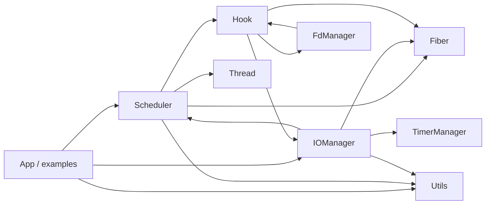
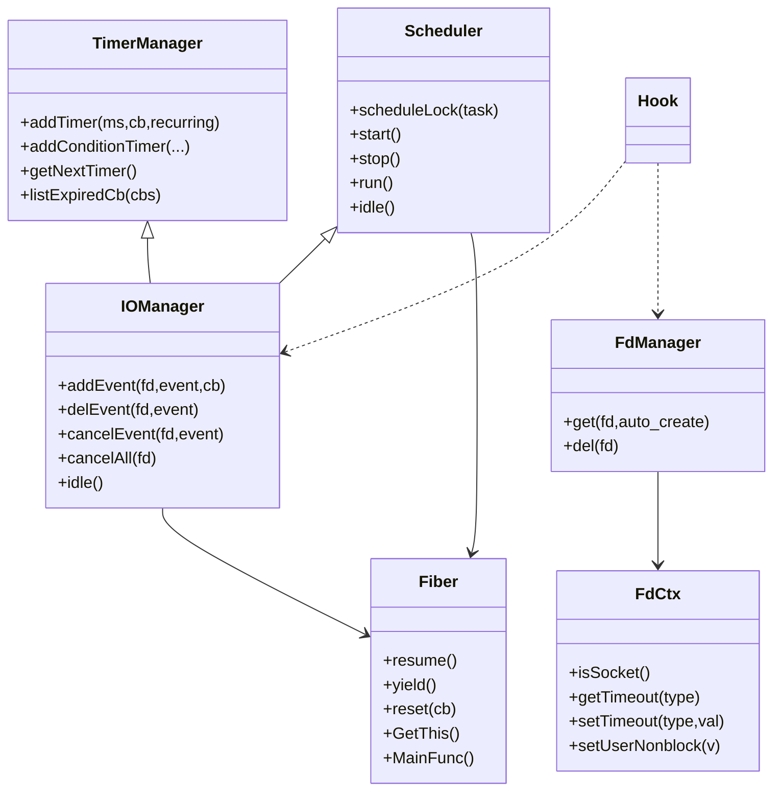

# MODULES

## 文档目的

本文档逐模块说明当前项目的职责划分、接口、依赖和调用关系。内容完全基于现有代码目录 `include/mycoroutine` 与 `src`。

---

## 1. 模块调用关系图（Mermaid）

---

## 2. 核心类/结构关系图（Mermaid）

---

## 3. `fiber` 模块（协程对象 + context）

## 模块名称

`fiber`

## 所在文件

- `include/mycoroutine/fiber.h`
- `src/fiber.cpp`

## 模块职责

- 表达协程实体（ID、状态、栈、回调）
- 管理 `ucontext_t` 上下文
- 提供协程恢复/让出接口
- 管理线程本地协程指针（当前协程/主协程/调度协程）

## 核心数据结构

- `Fiber`
  - `m_id`
  - `m_state`（`READY/RUNNING/TERM`）
  - `m_ctx`（`ucontext_t`）
  - `m_stack`, `m_stacksize`
  - `m_cb`
  - `m_runInScheduler`
- TLS：`t_fiber`, `t_thread_fiber`, `t_scheduler_fiber`

## 对外接口

- `Fiber(cb, stacksize, run_in_scheduler)`
- `resume()`
- `yield()`
- `reset(cb)`
- `static GetThis()` / `SetThis()` / `SetSchedulerFiber()` / `GetFiberId()`

## 依赖关系

- 依赖：`ucontext`、`atomic`、`functional`
- 被调用：`Scheduler`、`IOManager`、`Hook`

## 被谁调用

- `Scheduler::run()` 调用 `resume()`
- Hook 定时回调恢复协程时通过 `scheduleLock(fiber)` 间接调用

## 调用谁

- `swapcontext`, `getcontext`, `makecontext`

## 关键实现要点

- `MainFunc` 作为统一入口，处理回调执行、异常捕获、状态收敛与 `yield`
- `run_in_scheduler` 决定切回 `scheduler_fiber` 还是 `thread_fiber`

## 当前局限

- 协程状态只有 3 种，缺少更细粒度状态（如 BLOCKED/CANCELLED）
- 栈固定分配策略，未做栈池

---

## 4. `scheduler` 模块（任务调度）

## 模块名称

`scheduler`

## 所在文件

- `include/mycoroutine/scheduler.h`
- `src/scheduler.cpp`

## 模块职责

- 管理任务队列
- 管理 worker 线程
- 执行协程任务与回调任务
- 提供调度生命周期（`start/stop`）

## 核心数据结构

- `ScheduleTask { fiber, cb, thread }`
- `m_tasks`：`std::vector<ScheduleTask>`
- `m_threads`：线程池
- `m_activeThreadCount`, `m_idleThreadCount`

## 对外接口

- `scheduleLock(fc, thread=-1)`
- `start()` / `stop()`
- `static GetThis()`

## 依赖关系

- 依赖：`Fiber`、`Thread`、`hook`
- 被调用：应用层、`IOManager`（继承）

## 被谁调用

- 用户程序提交任务
- `IOManager::FdContext::triggerEvent` 回调重新入队

## 调用谁

- `Fiber::resume()`
- `Thread` 创建与 `join`
- `set_hook_enable(true)`

## 关键实现要点

- 回调任务会被包装为临时协程执行
- 无任务时运行 `idle_fiber`
- 支持 `thread` 定向任务

## 当前局限

- 任务容器为单 `vector` 扫描，竞争和遍历成本较高
- 公平性/优先级控制较弱

---

## 5. `iomanager` 模块（事件循环）

## 模块名称

`iomanager`

## 所在文件

- `include/mycoroutine/iomanager.h`
- `src/iomanager.cpp`

## 模块职责

- 基于 `epoll` 注册/删除/触发 fd 事件
- 在 `idle()` 中阻塞等待 IO 与超时
- 将 IO 就绪事件转换为可调度任务

## 核心数据结构

- `FdContext`
  - `read` / `write` 两个 `EventContext`
  - `events` 位掩码
  - `mutex`
- `m_epfd`、`m_tickleFds`
- `m_fdContexts`（fd -> `FdContext*`）
- `m_pendingEventCount`

## 对外接口

- `addEvent(fd,event,cb)`
- `delEvent(fd,event)`
- `cancelEvent(fd,event)`
- `cancelAll(fd)`
- `static GetThis()`

## 依赖关系

- 继承 `Scheduler` 与 `TimerManager`
- 依赖 `Fiber` 进行挂起/恢复

## 被谁调用

- Hook 的 `do_io` / `connect_with_timeout`
- 应用代码直接注册事件

## 调用谁

- `epoll_ctl`, `epoll_wait`, `eventfd`
- `scheduleLock()` 投递回调/协程

## 关键实现要点

- `eventfd` 用于唤醒阻塞在 `epoll_wait` 的线程
- `triggerEvent` 触发后会清理事件上下文
- `idle()` 中统一处理：IO 事件 + 过期定时器

## 当前局限

- `FdContext` 以裸指针存储，生命周期管理需谨慎
- `tickle()` 对异常回写处理较保守（使用 `assert`）

---

## 6. `timer` 模块（定时任务）

## 模块名称

`timer`

## 所在文件

- `include/mycoroutine/timer.h`
- `src/timer.cpp`

## 模块职责

- 管理定时器对象集合
- 提供到期回调抽取
- 支持循环定时器和条件定时器

## 核心数据结构

- `Timer`
  - `m_ms`, `m_next`, `m_recurring`, `m_cb`
- `TimerManager`
  - `m_timers`（`std::set<shared_ptr<Timer>>`）
  - `m_tickled`

## 对外接口

- `addTimer(ms,cb,recurring)`
- `addConditionTimer(ms,cb,weak_cond,recurring)`
- `getNextTimer()`
- `listExpiredCb(cbs)`

## 依赖关系

- 被 `IOManager` 继承并消费

## 被谁调用

- Hook sleep/connect 超时路径
- `IOManager::idle()` 查询超时并抽取回调

## 调用谁

- `onTimerInsertedAtFront()`（由子类覆盖）

## 关键实现要点

- 通过比较器和 set 保持超时有序
- 新最早定时器插入时触发唤醒

## 当前局限

- 仍基于 `system_clock`，受系统时钟回拨影响

---

## 7. `hook` 模块（阻塞系统调用协程化）

## 模块名称

`hook`

## 所在文件

- `include/mycoroutine/hook.h`
- `src/hook.cpp`

## 模块职责

- 保存原始系统调用函数指针（`dlsym(RTLD_NEXT, ...)`）
- 根据线程级开关决定是否启用 Hook
- 在 `EAGAIN` 路径将阻塞 IO 转为事件等待

## 核心数据结构

- TLS 开关：`t_hook_enable`
- `timer_info`：记录超时取消状态

## 对外接口

- `set_hook_enable(bool)`
- `is_hook_enable()`
- 被 Hook 的系统调用：`sleep/usleep/nanosleep/socket/connect/accept/read/write/...`

## 依赖关系

- 依赖 `IOManager` 注册事件
- 依赖 `FdManager` 判断 fd 属性和超时
- 依赖 `Fiber` 执行 `yield`

## 被谁调用

- 运行时由系统调用重定向触发

## 调用谁

- 原始 libc 函数指针（`*_f`）
- `IOManager::addEvent/cancelEvent`

## 关键实现要点

- `do_io()` 统一封装读写类系统调用
- 超时通过条件定时器触发 `cancelEvent`
- 协程恢复后重试原调用

## 当前局限

- 线程局部开关，需确保运行线程正确启用
- 与第三方库的 Hook 兼容边界仍需实测

---

## 8. `fd_manager` 模块（fd 元信息）

## 模块名称

`fd_manager`

## 所在文件

- `include/mycoroutine/fd_manager.h`
- `src/fd_manager.cpp`

## 模块职责

- 提供 fd -> `FdCtx` 的上下文管理
- 记录 socket/nonblock/timeout/closed 等属性

## 核心数据结构

- `FdCtx`
  - `m_isSocket`, `m_sysNonblock`, `m_userNonblock`
  - `m_recvTimeout`, `m_sendTimeout`
- `FdManager::m_datas`（vector）

## 对外接口

- `FdManager::get(fd, auto_create)`
- `FdManager::del(fd)`
- `FdCtx::set/getTimeout`
- `FdCtx::set/getUserNonblock`

## 依赖关系

- 依赖 `hook` 中原始 `fcntl_f`
- 被 Hook 与 IO 路径频繁使用

## 当前局限

- 单例生命周期由进程维度管理，缺少显式销毁策略

---

## 9. `thread` 与 `utils` 模块

## 模块名称

- `thread`
- `utils`

## 所在文件

- `include/mycoroutine/thread.h`, `src/thread.cpp`
- `include/mycoroutine/utils.h`, `src/utils.cpp`

## 模块职责

- `thread`：线程创建、命名、`join`、启动同步
- `utils`：基础日志输出

## 对外接口

- `Thread(cb, name)` / `join()` / `GetThreadId()`
- `Logger::GetInstance().log(...)`

## 当前局限

- 日志能力较基础，未接入 trace/span

---

## 10. 模块协作结论

该项目最核心的协作链路是：

`Hook -> IOManager(epoll/timer) -> Scheduler -> Fiber`

这一链路保证了：
- 业务代码可以保留同步风格
- 线程不被阻塞系统调用长期占用
- 任务、IO、超时在统一调度框架下运行

