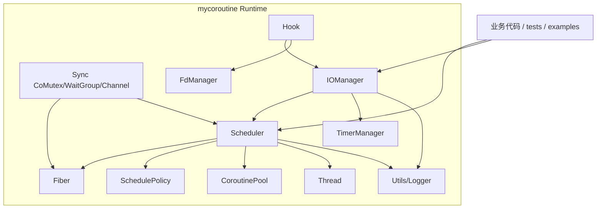

# 架构设计

## 0. 文档用途
说明 `mycoroutine` 当前版本的整体架构、模块关系与核心运行时路径。

## 1. 总体结构

`mycoroutine` 当前可以分为四层：
1. 基础设施层：`thread / utils / fd_manager`
2. 协程与调度层：`fiber / scheduler / coroutine_pool`
3. 事件与时间层：`iomanager / timer`
4. 系统调用适配层：`hook`

## 2. 核心组件
- `Fiber`：协程对象、汇编上下文切换（x86_64/AArch64）、共享栈快照、嵌套调用 `call/back`
- `Scheduler`：`deque` 任务队列、线程调度、策略选择（FIFO/PRIORITY/MLFQ/EDF/HYBRID）
- `CoroutinePool`：回调协程复用
- `Sync`：协程同步原语（`CoMutex`、`WaitGroup`、`Channel<T>`）
- `IOManager`：`epoll + eventfd` 事件循环
- `TimerManager`：定时器管理
- `hook`：阻塞系统调用协程化

## 3. 架构关系图

## 4. 关键运行时路径

### 4.1 调度执行路径
1. 上层提交任务：`scheduleLock/scheduleEx/scheduleShared`
2. `Scheduler::pickNextTaskLocked()` 按策略选任务
3. 若任务是 `fiber`，直接 `resume()`
4. 若任务是 `cb`，先经 `CoroutinePool::acquire()` 包装执行
5. 协程执行后：
   - `TERM`：回调协程可回收到池
   - `READY` 且策略为 MLFQ：按配置回灌队列

### 4.2 共享栈路径
1. 共享栈 Fiber 在 `resume()` 前执行 `prepareSharedStack()`
2. 若槽位 owner 变化，旧 owner 先保存快照
3. 当前 Fiber 恢复快照后切入执行

### 4.3 嵌套协程路径
1. `child->call()` 建立父子关系并切入子协程
2. 子协程 `yield()` 时优先 `back()` 返回父协程
3. `call()` 返回错误码，非法组合不会进入未定义行为路径

## 5. TLS 运行态对象
- `t_scheduler`：当前线程调度器
- `t_fiber`：当前运行协程
- `t_thread_fiber`：线程主协程
- `t_scheduler_fiber`：调度协程

## 6. 当前架构边界
- 父子协程同时共享栈的嵌套调用未开放，`call()` 返回 `CALL_ERR_SHARED_NESTED_UNSUPPORTED`。
- 调度器任务容器为全局 `deque` + 选取扫描模型，任务规模极大时选取成本增加。
- 仅支持 Linux 平台（依赖 `epoll`、`eventfd`、`dlsym`），x86_64 和 AArch64 架构。
