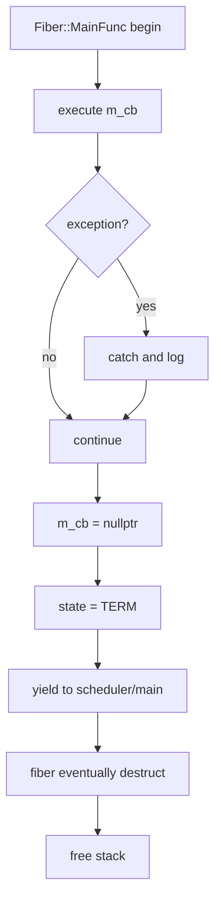

# 核心流程说明

## 0. 文档目的

本文档描述项目从启动到退出的关键运行流程，包括协程创建、调度、切换、事件处理和退出路径。

---

## 1. 程序启动流程

典型入口（以 `examples/coroutine_http_server.cpp` 为例）：

1. 创建监听 socket、`bind`、`listen`
2. 构造 `IOManager iom(...)`
3. `IOManager` 构造中初始化 `epoll/eventfd/fd context`，并调用 `start()` 启动调度线程
4. 注册监听 fd 的 `READ` 事件回调
5. 调度线程进入 `Scheduler::run()`，无任务时进入 `IOManager::idle()` 等待事件

---

## 2. 程序启动流程图（Mermaid）

```mermaid
flowchart TD
    A[main()] --> B[create socket/bind/listen]
    B --> C[construct IOManager]
    C --> D[epoll_create + eventfd + contextResize]
    D --> E[Scheduler::start]
    E --> F[worker threads run Scheduler::run]
    F --> G[register listen fd READ callback]
    G --> H[IOManager::idle epoll_wait]
```

---

## 3. 调度器初始化流程

`Scheduler` 初始化关键点：

- 构造函数中：
  - 记录名称、线程数量
  - 若 `use_caller=true`：
    - 创建当前线程主协程 `Fiber::GetThis()`
    - 创建 `m_schedulerFiber`（执行 `Scheduler::run`）
- `start()` 中：创建 worker 线程并运行 `run()`
- `run()` 入口：执行 `set_hook_enable(true)`，确保该线程 Hook 生效

---

## 4. 协程创建流程

项目中存在两种协程创建路径：

1. 显式创建协程：`std::make_shared<Fiber>(cb)`
2. 回调任务被调度器包装为临时协程（`task.cb -> cb_fiber`）

协程创建本质步骤：
- 分配栈
- `getcontext`
- 设置 `uc_stack`
- `makecontext(Fiber::MainFunc)`

---

## 5. 协程创建流程图（Mermaid）

```mermaid
flowchart TD
    A[scheduleLock(cb/fiber)] --> B{is fiber?}
    B -- yes --> C[use existing Fiber]
    B -- no --> D[create Fiber(cb)]

    D --> E[malloc stack]
    E --> F[getcontext]
    F --> G[setup uc_stack]
    G --> H[makecontext MainFunc]

    C --> I[enqueue task]
    H --> I
    I --> J[Scheduler::run picks task]
```

---

## 6. 协程调度流程

`Scheduler::run()` 主循环：

1. 从 `m_tasks` 扫描可执行任务（考虑线程亲和）
2. 若是协程任务，`resume()`
3. 若是回调任务，封装协程后 `resume()`
4. 若无任务，运行 `idle_fiber`
5. 若 `idle_fiber` 结束（满足 `stopping`），退出调度循环

---

## 7. 协程切换流程

切换由 `Fiber::resume/yield` 完成：

- `resume`：当前上下文 -> 协程上下文
- `yield`：协程上下文 -> 调度/主协程上下文

切换基于 `swapcontext`，且 `m_runInScheduler` 决定切回谁。

---

## 8. 协程调度与切换流程图（Mermaid）

```mermaid
flowchart TD
    A[Scheduler::run loop] --> B[pick task]
    B --> C{task type}
    C -- fiber --> D[fiber.resume]
    C -- cb --> E[make cb_fiber + resume]

    D --> F[Fiber::MainFunc or resumed frame]
    E --> F

    F --> G{need yield?}
    G -- yes --> H[fiber.yield -> back to scheduler]
    G -- no --> I[cb finished -> TERM -> yield]

    H --> A
    I --> A
```



---

## 9. I/O 与事件处理流程

当 Hook 生效并出现 `EAGAIN`：

1. `do_io()` 调用 `IOManager::addEvent(fd,event)`
2. 当前协程 `yield()` 挂起
3. `IOManager::idle()` 在 `epoll_wait` 收到 fd 就绪
4. `FdContext::triggerEvent` 把对应协程/回调重新 `scheduleLock`
5. 协程恢复后重试系统调用

超时路径：
- `do_io()` 同时注册条件定时器
- 超时回调触发 `cancelEvent`，恢复协程并返回 `ETIMEDOUT`

---

## 10. 协程退出流程

退出统一走 `Fiber::MainFunc`：

1. 执行回调（带异常保护）
2. `m_cb=nullptr`
3. `m_state=TERM`
4. `yield()` 返回调度侧

协程对象生命周期结束时析构并释放栈内存。

---

## 11. 协程退出流程图（Mermaid）



---

## 12. 关键调用链（函数级）

## 12.1 任务调度链

`scheduleLock -> Scheduler::run -> Fiber::resume -> Fiber::MainFunc -> Fiber::yield`

## 12.2 IO 协程化链

`read/write/connect (hook) -> do_io/connect_with_timeout -> IOManager::addEvent -> Fiber::yield -> IOManager::idle(epoll_wait) -> triggerEvent -> scheduleLock -> Fiber::resume`

## 12.3 定时器链

`addTimer -> TimerManager::m_timers -> IOManager::idle(getNextTimer/listExpiredCb) -> scheduleLock(cb)`

---

## 13. 流程级注意事项

- Hook 是线程局部开关；当前实现在 `Scheduler::run` 中自动开启。
- 事件触发后任务是“重新入队”而不是“立即执行”，仍遵循统一调度逻辑。
- `IOManager` 析构时会先 `stop()`，再关闭 `epoll/eventfd` 并清理上下文。

