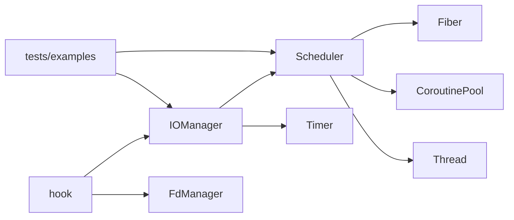

# 模块职责

## 0. 文档用途
说明当前项目主要模块的文件位置、职责、核心接口、调用关系与关键实现逻辑。

## 1. 模块总览

| 模块 | 文件位置 | 模块职责 |
|---|---|---|
| coroutine/fiber | `include/mycoroutine/fiber.h` `src/fiber.cpp` | 协程对象、上下文切换、共享栈、嵌套调用 |
| scheduler | `include/mycoroutine/scheduler.h` `src/scheduler.cpp` | 任务队列、线程调度、策略选取、协程池接入 |
| coroutine_pool | `include/mycoroutine/coroutine_pool.h` `src/coroutine_pool.cpp` | 复用终止 Fiber，控制缓存容量 |
| iomanager | `include/mycoroutine/iomanager.h` `src/iomanager.cpp` | `epoll + eventfd` 事件驱动与 IO 任务恢复 |
| timer | `include/mycoroutine/timer.h` `src/timer.cpp` | 定时器管理与超时回调 |
| hook | `include/mycoroutine/hook.h` `src/hook.cpp` | 阻塞系统调用协程化 |
| fd_manager | `include/mycoroutine/fd_manager.h` `src/fd_manager.cpp` | fd 上下文与超时属性 |
| thread | `include/mycoroutine/thread.h` `src/thread.cpp` | 线程封装与 TLS 线程信息 |
| utils | `include/mycoroutine/utils.h` `src/utils.cpp` | 日志与通用工具 |

## 2. 模块明细

### 2.1 coroutine/fiber
- 文件位置：`include/mycoroutine/fiber.h`，`src/fiber.cpp`
- 模块职责：
  - 管理协程状态机：`READY/RUNNING/TERM`
  - 提供 `resume/yield` 切换
  - 提供共享栈槽位占用切换与栈快照
  - 提供父子协程嵌套调用 `call/back`
- 核心接口：
  - `Fiber(cb, stacksize, run_in_scheduler, use_shared_stack)`
  - `reset(cb)`
  - `resume()` / `yield()`
  - `int call()` / `back()` / `parent()`
  - `SetSharedStackSlotCount()` / `GetSharedStackSlotCount()`
- 关键返回码：
  - `CALL_OK`
  - `CALL_ERR_NOT_READY`
  - `CALL_ERR_NO_CURRENT_FIBER`
  - `CALL_ERR_SELF_CALL`
  - `CALL_ERR_SHARED_NESTED_UNSUPPORTED`
- 调用关系：
  - 被 `Scheduler` 执行和调度
  - 依赖 `Thread` 获取线程 ID

### 2.2 scheduler
- 文件位置：`include/mycoroutine/scheduler.h`，`src/scheduler.cpp`
- 模块职责：
  - 管理线程池与任务队列
  - 依据策略选择下一个任务
  - 运行 Fiber 或回调任务
  - 回调任务接入协程池复用
- 核心接口：
  - `scheduleLock(fc, thread)`
  - `scheduleEx(fc, ScheduleOptions)`
  - `scheduleShared(cb, stacksize, thread)`
  - `setPolicy()` / `getPolicy()`
  - `setMLFQConfig()` / `getMLFQConfig()`
  - `setCoroutinePoolMaxCachedPerKey()` / `getCoroutinePoolCachedCount()`
  - `start()` / `stop()`
- 调用关系：
  - 调用 `Fiber` 执行协程
  - 调用 `CoroutinePool` 复用回调协程
  - 被 `IOManager` 继承扩展
- 关键实现逻辑：
  - `pickNextTaskLocked()` 实现 FIFO/PRIORITY/MLFQ/EDF/HYBRID 五种选取规则。

### 2.3 coroutine_pool
- 文件位置：`include/mycoroutine/coroutine_pool.h`，`src/coroutine_pool.cpp`
- 模块职责：
  - 缓存并复用 `TERM` Fiber
  - 限制每个 key 的缓存数量
- 核心接口：
  - `acquire(cb, stacksize, run_in_scheduler, use_shared_stack)`
  - `release(fiber, stacksize, run_in_scheduler, use_shared_stack)`
  - `setMaxCachedPerKey()` / `getMaxCachedPerKey()`
  - `cachedCount()` / `clear()`
- 关键实现逻辑：
  - 通过 `makeKey()` 将栈配置与运行模式编码到同一桶键。

### 2.4 iomanager
- 文件位置：`include/mycoroutine/iomanager.h`，`src/iomanager.cpp`
- 模块职责：
  - 管理 `epoll` 事件和 `eventfd` 唤醒
  - 将 IO 就绪事件转为调度任务
- 核心接口：
  - `addEvent()` / `delEvent()` / `cancelEvent()` / `cancelAll()`
- 调用关系：
  - 继承 `Scheduler` 和 `TimerManager`
  - 被 `hook` 调用

### 2.5 timer
- 文件位置：`include/mycoroutine/timer.h`，`src/timer.cpp`
- 模块职责：
  - 维护定时器集合
  - 提供到期回调收集
- 核心接口：
  - `addTimer()` / `addConditionTimer()`
  - `getNextTimer()` / `listExpiredCb()`

### 2.6 hook + fd_manager
- 文件位置：
  - hook：`include/mycoroutine/hook.h`，`src/hook.cpp`
  - fd_manager：`include/mycoroutine/fd_manager.h`，`src/fd_manager.cpp`
- 模块职责：
  - `hook`：将阻塞 IO 改写为协程等待
  - `fd_manager`：记录 fd 的属性和超时
- 核心接口：
  - `set_hook_enable()` / `is_hook_enable()`
  - `FdMgr::get()` / `FdMgr::del()`

### 2.7 thread + utils
- 文件位置：
  - thread：`include/mycoroutine/thread.h`，`src/thread.cpp`
  - utils：`include/mycoroutine/utils.h`，`src/utils.cpp`
- 模块职责：
  - `thread`：线程创建、join、线程名
  - `utils`：日志和基础工具

## 3. 调用关系图

## 4. 运行时调用顺序
1. 上层调用 `scheduleLock/scheduleEx/scheduleShared` 提交任务。
2. `Scheduler` 按当前策略在 `pickNextTaskLocked()` 选任务。
3. 任务为 `fiber` 时直接 `resume()`；任务为 `cb` 时走 `CoroutinePool`。
4. Fiber 执行过程中可 `yield()`，在 MLFQ 下按配置重新入队。
5. IO 类任务由 `IOManager + hook` 在事件就绪后恢复执行。
